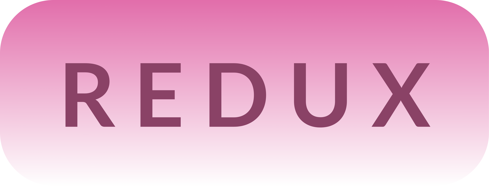
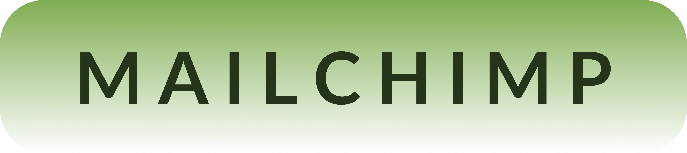

# Hi there, I'm Lons! 👋

I'm a software developer and technical writer with experience in the higher education, medical device, and web3 industries.

📭 I'm open for work!  Please contact me at contact@lons.dev if you're looking for an entry-level software developer, a docs-as-code technical writer, or some combination of those.

## Skills

### 💻 Tech stack

### 🛠️ Tools

### CliftonStrengths

## Projects

### Student projects

|   |   |
| --- | --- |
|  | SKATE:30 is a web app that hockey players can use to coordinate pickup hockey and free skate times with their friends in the Twin Cities metro area. The application is optimized for mobile browsers. |
|  | Memento Box is an application that allows users to collaborate on a gift box.  Collaborators can add videos, images, letters, and voicenotes to a gift box that they then email to the recipient, which they can then view on the website. |

### Self-taught projects

|   |   |
| --- | --- |
| <a href="https://github.com/lonsnw/mailchimp-app"> 🐈 Mew can do it 🐈 </a> | This mewsletter app is a very simple app built to test adding recipients to a Mailchimp newsletter using the Mailchimp marketing API. |
| <a href="https://github.com/lonsnw/transactional-email-app"> 🐾 Momentary paws 🐾 </a> | Momentary paws is a very simple app built to test sending an inspirational HTML email using the Mailchimp transactional API. |

